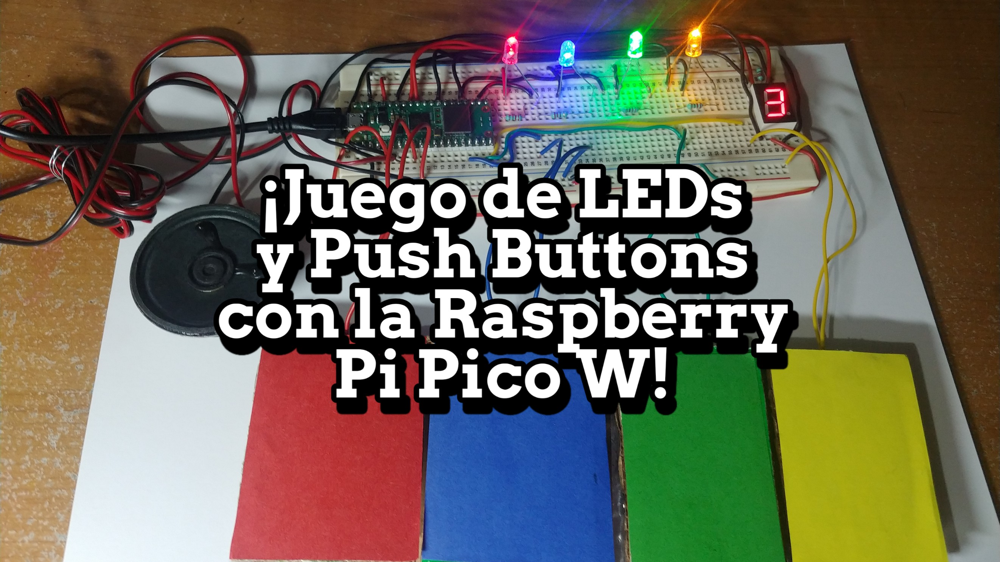
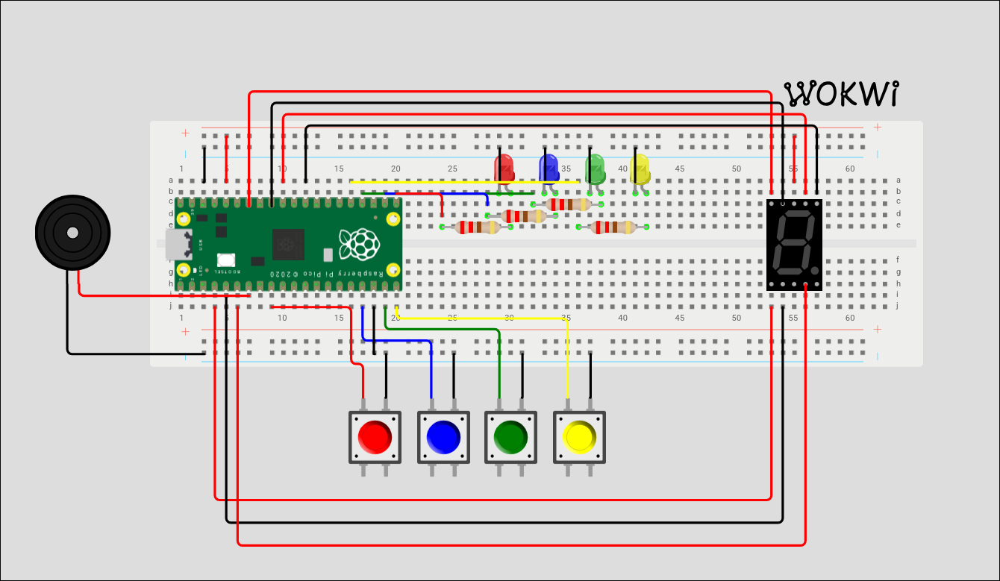

  

<h1 align="center">Juego de LEDs</h1>

  <b>Juego de reflejos con LEDs, botones y sonido usando MicroPython</b>

  
  
  
  

---

## ¿Qué es?

Es un juego de reflejos estilo *Simon Says* hecho con componentes electrónicos reales. Los LEDs se encienden siguiendo un patrón con distintas velocidades y el jugador debe presionar el botón correspondiente a cada LED antes de que se apague. Si aciertas sumas puntos, si fallas pierdes una vida. Tienes **3 vidas** y el objetivo es conseguir la mayor puntuación posible.

  

---

## Diagrama del Circuito

  

  <a href="https://wokwi.com/projects/395918837875412993">Mira el diagrama en Wokwi</a>

---

## ¿Cómo se juega?

1. Al encender, el display de 7 segmentos muestra **3** (tus vidas).
2. Los LEDs comienzan a encenderse uno por uno en un patrón definido.
3. Cuando un LED se enciende, presiona **rápidamente** el botón del mismo color.
4. Si presionas a tiempo → **+126 puntos** y suena una nota.
5. Si no presionas a tiempo → **-1 vida** y el display se actualiza.
6. El patrón se vuelve más rápido conforme avanza.
7. Cuando pierdes las 3 vidas, suena una melodía de *game over* y se muestra tu puntuación final.

---

## Componentes

| Componente | Cantidad | Conexión (GPIO) |
|---|---|---|
| LED rojo | 1 | Pin 16 |
| LED azul | 1 | Pin 17 |
| LED verde | 1 | Pin 18 |
| LED amarillo | 1 | Pin 19 |
| Botón rojo | 1 | Pin 6 (PULL_UP) |
| Botón azul | 1 | Pin 13 (PULL_UP) |
| Botón verde | 1 | Pin 14 (PULL_UP) |
| Botón amarillo | 1 | Pin 15 (PULL_UP) |
| Display 7 segmentos (ánodo común) | 1 | Pines 2, 3, 4, 22, 26, 27, 28 |
| Speaker / buzzer | 1 | Pin 5 (PWM) |
| Raspberry Pi Pico | 1 | — |

---

## Características

- **Patrón de LEDs con velocidades variables** — cada LED tiene su propia duración, haciendo el juego progresivamente más difícil
- **Retroalimentación sonora** — cada botón emite una nota musical diferente al presionarse gracias a un segundo hilo de ejecución
- **Display de vidas en tiempo real** — el display de 7 segmentos muestra las vidas restantes (3, 2, 1, 0)
- **Melodía de game over** — secuencia de notas descendentes cuando pierdes todas las vidas
- **Multihilo** — usa `_thread` para manejar el sonido de los botones en paralelo sin bloquear el juego
- **Semáforo (lock)** — sincronización entre hilos para evitar conflictos

---

## ¿Cómo ejecutarlo?

1. Conecta todos los componentes al **Raspberry Pi Pico** según la tabla de conexiones.
2. Abre **Thonny** (o tu IDE de MicroPython preferido).
3. Carga el archivo `Juego.py` en el Pico.
4. Ejecuta el programa y a jugar.

---

## Tecnologías

  
  

---

  
  <i>"If you smile everyday and live happily from now on, then that's enough"</i> 
  <b>— Yuuichirou Hyakuya</b>

